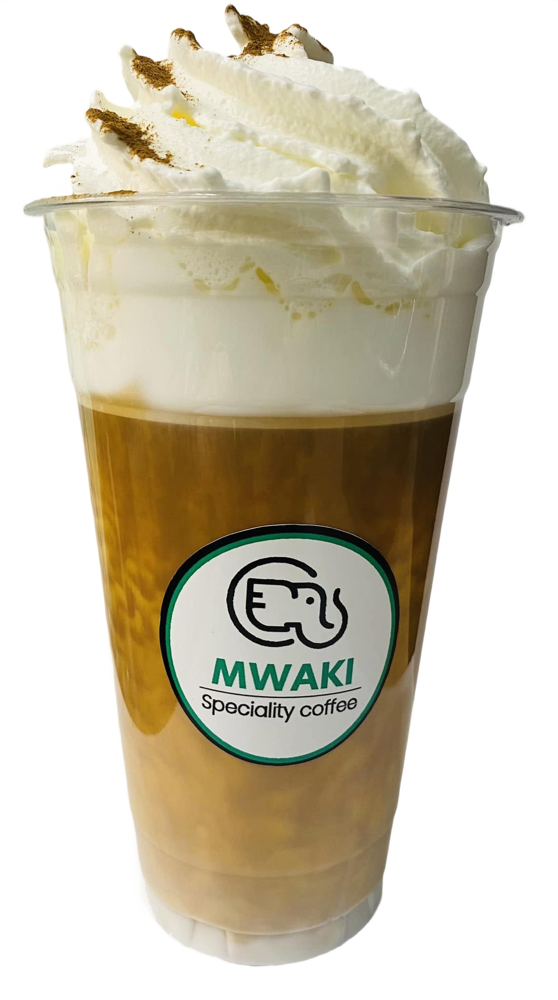
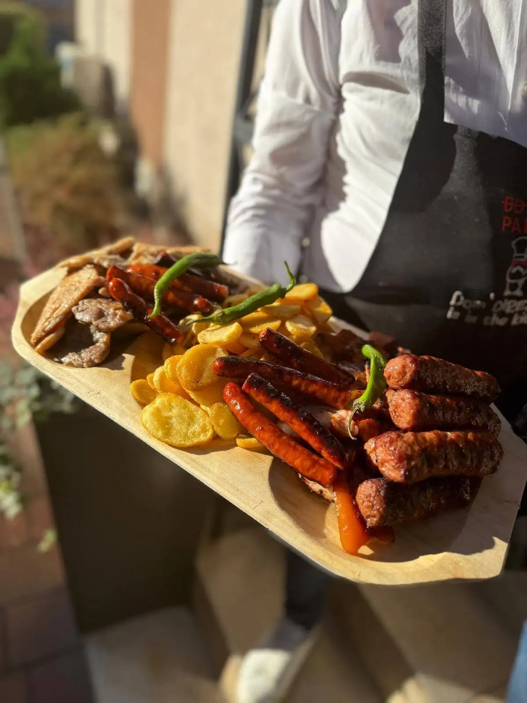
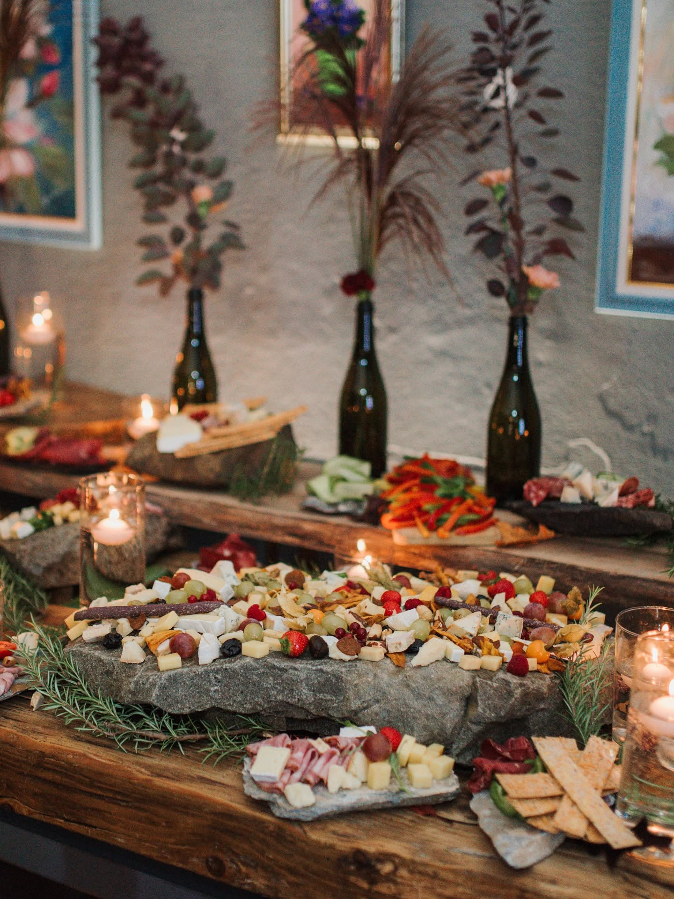

# Umar

### I turn practical ideas into useful, good-looking digital products.

I build websites, web apps, and desktop tools with a focus on clear design and a smooth experience.

  

---

## Restaurant & café websites

Real businesses, real menus, and visual experiences designed to make people want to visit.

<table>
<tr>
<td width="50%" valign="top" align="center">

<h3>MWAKI Speciality Coffee</h3>

A modern coffee-shop landing page with a bold product-led hero, menu, gallery, location, and mobile-friendly experience.

 

</td>
<td width="50%" valign="top" align="center">

<h3>Crema Restaurant</h3>

A warm bilingual restaurant website with a complete 17-category menu, reviews, map, and responsive mobile design.

 

</td>
</tr>
<tr>
<td colspan="2" valign="top" align="center">

<h3>Bistro GRAI Alba Iulia</h3>

A polished restaurant website built around atmosphere, food, and easy discovery—with bilingual menus, reservations, contact details, and a live production release.

</td>
</tr>
</table>

---

## More things I've built

<table>
<tr>
<td width="50%" valign="top">
<h3><a href="https://github.com/tsarumar/tahrirat-case-study">Tahrirat.net</a></h3>

An Arabic-first learning platform with lessons, enrolments, recording submissions, payments, and an admin workspace.

 

</td>
<td width="50%" valign="top">
<h3><a href="https://github.com/tsarumar/esn-erasmus-preview">Erasmus+ Planning Tools</a></h3>

A simple browser toolkit that helps Erasmus students plan their stay and find useful local information.

 

</td>
</tr>
<tr>
<td width="50%" valign="top">
<h3><a href="https://github.com/tsarumar/eShop-with-PHP-and-JavaScript">eShop</a></h3>

A complete customer-and-seller storefront with products, inventory, checkout, and secure accounts.

</td>
<td width="50%" valign="top">
<h3><a href="https://github.com/tsarumar/File-Search-Indexer">File Search Indexer</a></h3>

A fast desktop search tool with filters, pagination, recent-file views, and duplicate detection.

</td>
</tr>
</table>

## What I care about

<table>
<tr>
<td align="center">Clear, modern visuals</td>
<td align="center">Useful real-world features</td>
<td align="center">Simple user experiences</td>
<td align="center">Reliable finished products</td>
</tr>
</table>

### Want to see more?

